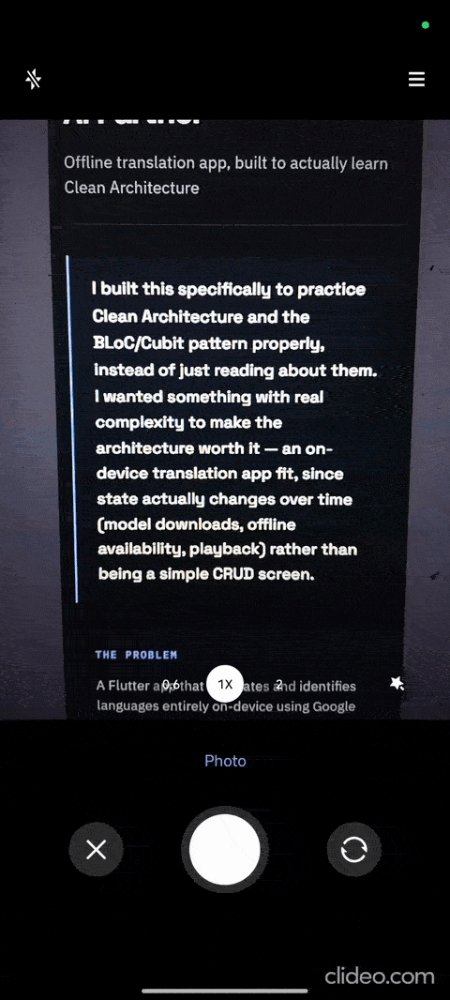
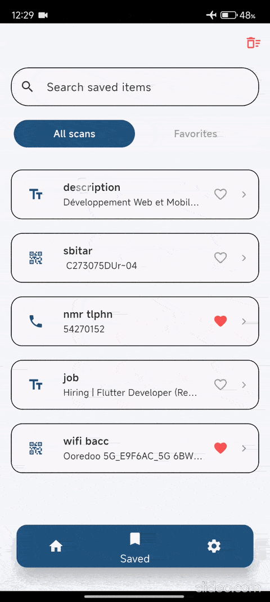
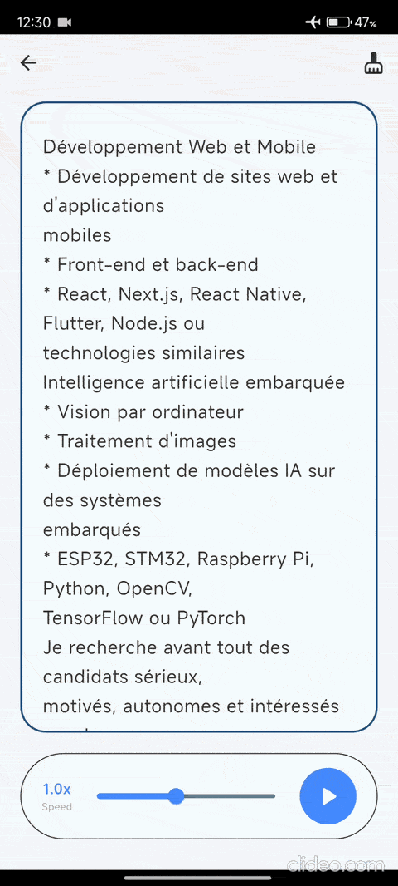
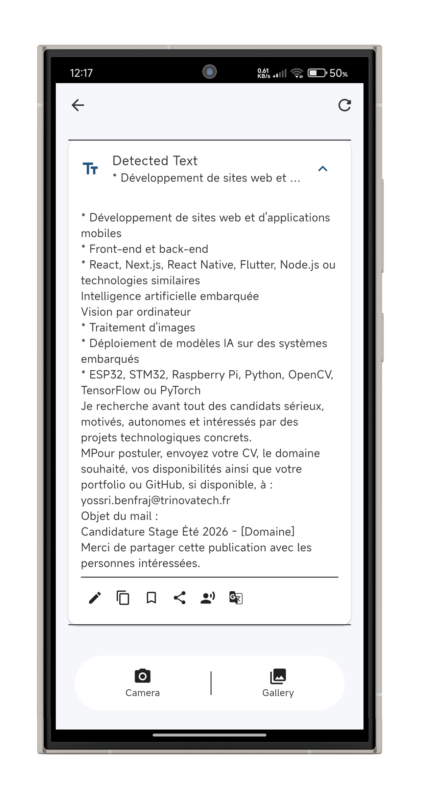
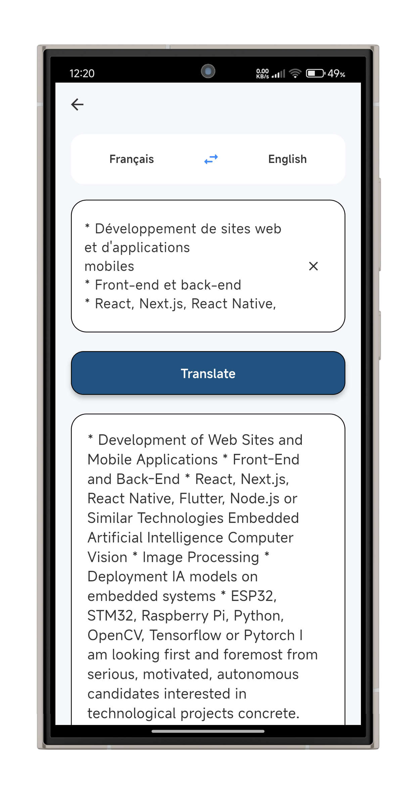
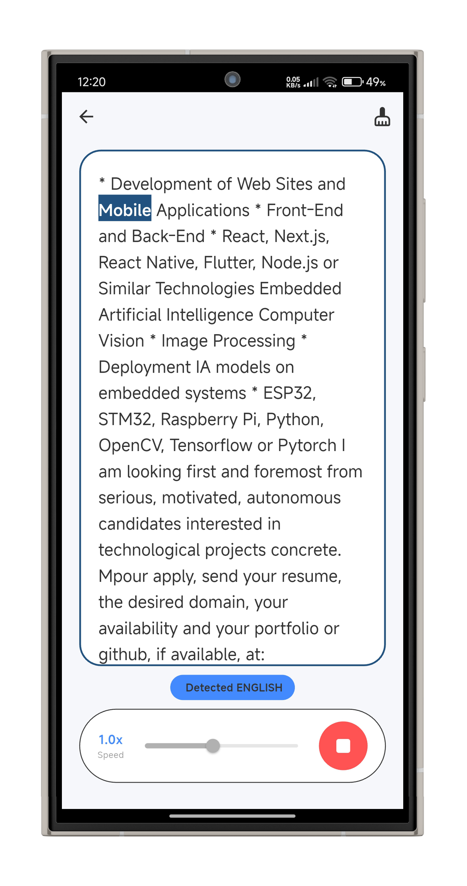
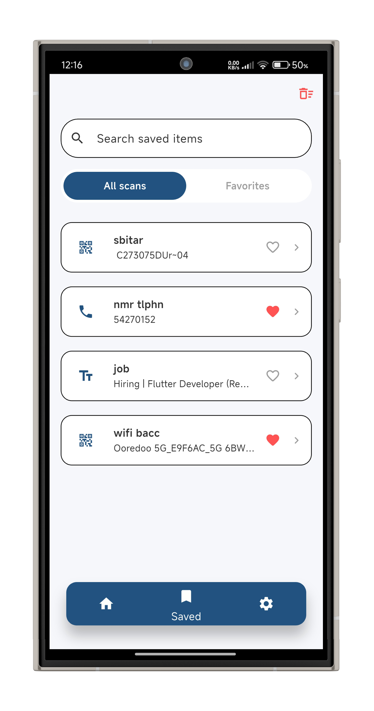
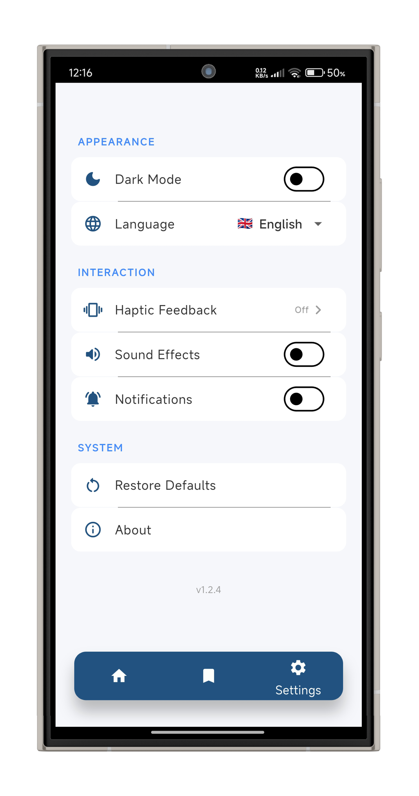

# AI Partner 🤖

**AI Partner** is a high-performance, offline-capable mobile assistant built with **Flutter**. It provides intelligent tools like real-time **on-device Text Recognition (OCR)**, seamless translation, and language identification using on-device Machine Learning, ensuring maximum privacy and zero latency.

> 📖 **Deep Dive:** I documented the full engineering process behind this app, including architecture diagrams and UI/UX decisions. **[Read the full technical case study on my portfolio here ↗](https://jecem-ben-slama.vercel.app/projects/ai-partner)**

<div align="center">

  <!-- REPLACE THESE WITH ACTUAL GITHUB HOSTED IMAGES/GIFS -->

  

  

  

</div>

---

## 🏗️ Architectural Decisions & Trade-offs

This project was built not just to solve a problem, but as a deliberate sandbox to rigorously apply **SOLID principles** and **Clean Architecture**.

* **BLoC/Cubit vs. Simpler State Management:**
    * *The Decision:* I intentionally chose BLoC/Cubit to manage the state.
    * *The Trade-off:* For a relatively straightforward feature set, this introduced significant boilerplate. However, it completely decoupled the UI from the business logic, making the state highly predictable and the translation services significantly easier to mock and test.
* **Strict Clean Architecture (Domain/Data/Presentation):**
    * *The Decision:* I separated all third-party SDKs (Google ML Kit, Flutter TTS) behind custom service abstractions and repositories.
    * *The Trade-off:* It increased initial development time, but it ensures that if Google ML Kit is deprecated tomorrow, the UI and logic layers remain entirely untouched when swapping the data source.
* **On-Device ML vs. Cloud API:**
    * *The Decision:* Utilizing local ML models for OCR and translation.
    * *The Trade-off:* It guarantees zero-latency and offline capability for the user, at the cost of a slightly larger initial APK size due to bundled models.

---

## ✨ Key Features

* **⚡ Real-Time OCR:** Extracts dense text blocks instantly from physical documents or images offline.
* **🌐 Offline Translation:** Powered by Google ML Kit, allowing for high-quality translations without an internet connection.
* **🧠 Automatic Language Identification:** Intelligently detects the source language of any input text.
* **🔊 Text-to-Speech (TTS):** Integrated vocalization engine with adjustable playback speed and localized voice support.
* **📂 Local History & Favorites:** Automatically saves your scans to local storage with full search and favorites management.
* **📳 Tactile UX:** Immersive user experience through custom haptic feedback patterns and synchronized success/error sound effects.

---

## 📱 UI Walkthrough

<div align="center">
  
  
  
  
  
</div>

---

## ⚙️ Tech Stack & Patterns

* **Framework:** [Flutter](https://flutter.dev)
* **State Management:** [flutter_bloc](https://pub.dev/packages/flutter_bloc)
* **Machine Learning:** [Google ML Kit](https://developers.google.com/ml-kit)
* **Hardware APIs:** Flutter TTS & Vibration
* **Patterns:** Dependency Injection (via `MultiRepositoryProvider`), Repository Pattern, Service Layer Abstraction.

---

## 🚀 Getting Started

Because this project relies on native hardware APIs and Machine Learning models, ensure your development environment meets the native requirements.

### Prerequisites
* Flutter SDK (v3.10.0 or higher)
* Android: `minSdkVersion 21` or higher (Required by ML Kit)
* iOS: iOS 12.0 or higher

### Installation

1. Clone the repository:
   ```bash
   git clone https://github.com/jecem-ben-slama/Ai_Partner.git
   ```

2. Navigate to the project directory:

   ```bash
   cd ai-partner
   ```

3. Install dependencies:

   ```bash
   flutter pub get
   ```

4. Run the app:

   ```bash
   flutter run
   ```


## 📂 Project Structure

```
lib/
├── core/
│   ├── theme/          # AppTheme, AppColors, and text styles
│   ├── l10n/           # Localization files (i18n)
│   └── utils/          # App-wide constants
├── logic/
│   ├── cubit/          # Feature-specific Cubits (Translation, TTS, Settings)
│   ├── repo/           # Repository layer for data abstraction
│   └── services/       # ML logic, Haptics, Sound, and Notifications
├── models/             # App-wide data models & entities 
├── presentation/
│   ├── screens/        # Main UI screens (Translator, TTS Player, Onboarding)
│   └── widgets/        # Reusable UI components
└── main.dart           # App entry & Dependency injection root
```
